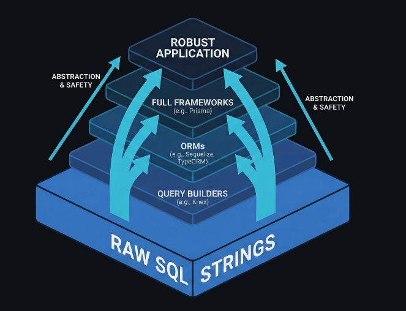

# Everything I Know About Node.js

**Started:** _April 26th, 2026_

**Note:** This section compiles different lessons from courses and other learning resources. Most of the theory was not written by me. These are the **references** for most of the knowledge in this section:

- [Full Stack Engineering Course | Build and Deploy a Full Stack PERN Admin Dashboard in 2026 - JavaScript Mastery](https://www.youtube.com/watch?v=ek7hmv5PVV8)

**Table of contents**

- [Everything I Know About Node.js](#everything-i-know-about-nodejs)
  - [What is Node?](#what-is-node)
  - [Creating a server in Node](#creating-a-server-in-node)
  - [What is Express?](#what-is-express)
  - [Creating a server with Express](#creating-a-server-with-express)
  - [Developing an API](#developing-an-api)
    - [Router](#router)
    - [Middleware](#middleware)
      - [Parsing JSON](#parsing-json)
      - [Logging](#logging)
      - [Helmet for secure HTTP response headers](#helmet-for-secure-http-response-headers)
    - [Implementing simple POST, PUT and DELETE API methods](#implementing-simple-post-put-and-delete-api-methods)
  - [Connecting Node to a PostgreSQL database](#connecting-node-to-a-postgresql-database)
    - [The most direct way: using the pg library](#the-most-direct-way-using-the-pg-library)
    - [ORMs (Object Relational Mappers)](#orms-object-relational-mappers)
      - [Prisma (heavy abstraction, opinionated)](#prisma-heavy-abstraction-opinionated)
      - [Drizzle ORM (light, less abstraction)](#drizzle-orm-light-less-abstraction)

## What is Node?

Node is a runtime environment for JavaScript, which makes it possible for it to run OUTSIDE of a browser (server-side). A server is nothing more than a program running indefinitely in a computer, that is listening to requests and responding to them.

When you download Node, you get:

- Node JS, the program that executes JavaScript files
- NPM, a package manager that installs libraries
- REPL (Read-Eval-Print-Loop), similar to the Python shell, you can open it up by typing `node` in a terminal. It lets you write and execute JavaScript code

Since Node does not run in a browser, all objects related to `window` and `document` will break your code. For example, running `alert()` or `prompt()` will fail.

However, Node provides a different set of tools, such as:

- File system access (`fs`)
- Network utilities
- Streams and buffers
- Events
- Built-in modules like `http`, `crypto`, `path`, and `os`

Writing programs with only Node is possibly, but you have to manually handle:

- Parsing bodies
- Handling errors
- Routing logic
- Building a middleware system

That is why higher-level frameworks exist on top of Node, like [Express](https://github.com/ingridcoll/everything-i-know/tree/main/Backend/Express.js.md), Koa, Nest, Fastify or Hono.

## Creating a server in Node

To create a local server only with Node, write:

```javascript
// /server.js
import http from "http";

const port = 3000;

const server = http.createServer((req, res) => {
  res.writeHead(200, "Success!");
  res.end("Yay, it's live");
});

server.listen(port, () =>
  console.log(`Server is running on http://localhost:${port}`),
);
```

Then `cd` into the project's folder, and run `node server.js`. The server is live.

## What is Express?

Express.js is a minimal framework that sits on top of Node.js and makes handling http requests and sending responses easier.

It gives you:

- Routing
- Middleware: lets you extend behavior like adding loggers, authentication, etc.
- A cleaner request/response API

It doesn't tell you how to structure your app, where to put your files, or how to handle authorization, logging, or databases. You decide all of that. In the bigger picture, Express is the foundation that most Node.js backend tools build on top of, including NestJS. It's the HTTP layer. Everything else, your business logic, your database access, your auth, sits above it.

Express is a good choice when you need fast and flexible, for example for REST APIs, microservices, and mobile backends.

## Creating a server with Express

To create a local server with Express, write:

```javascript
// server.js
import express from "express";

const app = express();

const port = 3000;

// Add any of the HTTP methods, like app.post, app.put, or app.delete
app.get("/", (req, res) => {
  res.send("Hi");
});

// A dynamic route
app.get("/v1/pokemon/:id", (req, res) => {
  let pokemonId = req.params.id;
  res.send(`You selected Pokemon #${pokemonId}`);
});

app.listen(3000, console.log(`Server is running on http://localhost:${port}`));
```

Then, add the script `node server.js` to your `package.json` to start up the server.

## Developing an API

### Router

You can add routers to avoid repeating code like the pre-fix of each API route. For example, if your API starts with `/api/v1/pokemon`:

```javascript
// server.js
import express from "express";

const app = express();

const port = 3000;

const router = express.Router(); // Initialize router here

// Add any of the HTTP methods, like app.post, app.put, or app.delete
router.get("/", (req, res) => {
  res.send("Hi");
});

// A dynamic route
router.get("/:id", (req, res) => {
  // We can delete the pre-fix /api/v1/pokemon
  let pokemonId = req.params.id;
  res.send(`You selected Pokemon #${pokemonId}`);
});

app.use("/api/v1/pokemon", router); // Define API pre-fix

app.listen(3000, console.log(`Server is running on http://localhost:${port}`));
```

### Middleware

Express makes it easy to add middleware. Common real uses for middleware:

- Logging - record every request (method, URL, timestamp, response time)
- Authentication - verify a token before the request reaches any route
- Request parsing - `express.json()` is itself middleware that reads the raw body and puts it on req.body
- Rate limiting - count requests per IP, reject if too many
- CORS headers - tell browsers which origins are allowed to call your API
- Input sanitization - strip dangerous characters before your routes touch the data
- Compression
- Validation
- Error handling
- Performance
- Bot protection

One responsibility per middleware block. Don't bundle logging with auth with rate limiting into one function.

#### Parsing JSON

We want to be able to parse JSON requests and responses. Simply add `app.use(express.json())` when creating the server.

```javascript
// server.js
import express from "express";

const app = express();

const port = 3000;

const router = express.Router();

app.use(express.json()); // Middleware that parses JSON

const pokemon = [
  // Sample data
  {
    id: 1,
    name: "Bulbasaur",
    type: ["Grass", "Poison"],
    base: {
      HP: 45,
      Attack: 49,
      Defense: 49,
      "Sp. Attack": 65,
      "Sp. Defense": 65,
      Speed: 45,
    },
    description:
      "Bulbasaur can be seen napping in bright sunlight. There is a seed on its back. By soaking up the sun’s rays, the seed grows progressively larger.",
    height: 0.7,
    weight: 6.9,
    evolves: true,
  },
  {
    id: 2,
    name: "Ivysaur",
    type: ["Grass", "Poison"],
    base: {
      HP: 60,
      Attack: 62,
      Defense: 63,
      "Sp. Attack": 80,
      "Sp. Defense": 80,
      Speed: 60,
    },
    description:
      "There is a bud on this Pokémon’s back. To support its weight, Ivysaur’s legs and trunk grow thick and strong. If it starts spending more time lying in the sunlight, it’s a sign that the bud will bloom into a large flower soon.",
    height: 1,
    weight: 13,
    evolves: true,
  },
  {
    id: 3,
    name: "Venusaur",
    type: ["Grass", "Poison"],
    base: {
      HP: 80,
      Attack: 82,
      Defense: 83,
      "Sp. Attack": 100,
      "Sp. Defense": 100,
      Speed: 80,
    },
    description:
      "There is a large flower on Venusaur’s back. The flower is said to take on vivid colors if it gets plenty of nutrition and sunlight. The flower’s aroma soothes the emotions of people.",
    height: 2,
    weight: 100,
    evolves: false,
  },
];

router.get("/", (req, res) => {
  res.json(pokemon); // Send the data array as response in JSON format
});

router.get("/:id", (req, res) => {
  let pokemonId = req.params.id;
  res.send(`Select Pokemon with ID #${pokemonId}`);
});

router.post("/", (req, res) => {
  res.send("Create new Pokemon");
});

router.put("/:id", (req, res) => {
  let pokemonId = req.params.id;
  res.send(`Update Pokemon with ID #${pokemonId}`);
});

app.use("/api/v1/pokemon", router);

app.listen(3000, console.log(`Server is running on http://localhost:${port}`));
```

#### Logging

Another useful form of middleware is the ability to log every time our API is hit.

```javascript
// Log each hit to the API
app.use((req, res, next) => {
  const timestamp = new Date().toISOString();

  console.log(`[${timestamp}] ${req.method} ${req.url}`);

  // After request is done, also log response headers
  res.on("finish", () => {
    console.log(
      `[${timestamp}] RESPONSE HEADERS: ${res.statusCode}`,
      res.getHeaders(),
    );
  });

  next();
});
```

The order of each middleware block matters. Logging should be place before the router logic, so the API hit is registered before it goes down each definition's path.

#### Helmet for secure HTTP response headers

[Helmet](https://helmetjs.github.io/#get-started) helps secure Node/Express apps. It sets HTTP response headers such as Content-Security-Policy and Strict-Transport-Security. It aims to be quick to integrate and be low maintenance afterward. To implement:

```bash
npm install helmet
```

```javascript
import helmet from "helmet";

const app = express();

app.use(helmet());
```

### Implementing simple POST, PUT and DELETE API methods

This sample API, shows how to handle errors and implement different methods:

```javascript
import express from "express";
import { ValidationError, NotFoundError } from "./errors.js";

// Initialize Express variables
const app = express();

const port = 3000;

const router = express.Router();

// Sample data
const pokemon = [
  {
    id: 1,
    name: "Bulbasaur",
    type: ["Grass", "Poison"],
    base: {
      HP: 45,
      Attack: 49,
      Defense: 49,
      "Sp. Attack": 65,
      "Sp. Defense": 65,
      Speed: 45,
    },
    description:
      "Bulbasaur can be seen napping in bright sunlight. There is a seed on its back. By soaking up the sun’s rays, the seed grows progressively larger.",
    height: 0.7,
    weight: 6.9,
    evolves: true,
  },
  {
    id: 2,
    name: "Ivysaur",
    type: ["Grass", "Poison"],
    base: {
      HP: 60,
      Attack: 62,
      Defense: 63,
      "Sp. Attack": 80,
      "Sp. Defense": 80,
      Speed: 60,
    },
    description:
      "There is a bud on this Pokémon’s back. To support its weight, Ivysaur’s legs and trunk grow thick and strong. If it starts spending more time lying in the sunlight, it’s a sign that the bud will bloom into a large flower soon.",
    height: 1,
    weight: 13,
    evolves: true,
  },
  {
    id: 3,
    name: "Venusaur",
    type: ["Grass", "Poison"],
    base: {
      HP: 80,
      Attack: 82,
      Defense: 83,
      "Sp. Attack": 100,
      "Sp. Defense": 100,
      Speed: 80,
    },
    description:
      "There is a large flower on Venusaur’s back. The flower is said to take on vivid colors if it gets plenty of nutrition and sunlight. The flower’s aroma soothes the emotions of people.",
    height: 2,
    weight: 100,
    evolves: false,
  },
];

// Express Middleware
app.use(express.json()); // Parse responses in JSON format

// Log each hit to the API
app.use((req, res, next) => {
  const timestamp = new Date().toISOString();

  console.log(`[${timestamp}] ${req.method} ${req.url}`);

  next();
});

app.use("/api/v1/pokemon", router); // Add prefix to request and route to a defined path

// Route definitions
router.get("/", (req, res) => {
  res.json(pokemon);
});

router.get("/:id", (req, res) => {
  try {
    const selectedPokemon = findSelectedPokemon(req.params.id);
    return res.send(selectedPokemon);
  } catch (error) {
    if (error instanceof NotFoundError) {
      res.status(404).send(error.message);
    }
  }
});

router.post("/", (req, res) => {
  const requestBody = req.body;
  try {
    validateRequestKeys(requestBody);

    const newPokemon = { id: pokemon.length + 1, ...requestBody };

    pokemon.push(newPokemon);

    res
      .status(201)
      .send(
        `Pokemon with ID #${newPokemon.id} created. ${JSON.stringify(newPokemon)}`,
      );
  } catch (error) {
    if (error instanceof ValidationError) {
      res.status(400).send(error.message);
    } else {
      res.status(500).send("Something went wrong!");
    }
  }
});

router.put("/:id", (req, res) => {
  try {
    const selectedPokemon = findSelectedPokemon(req.params.id);
    const requestBody = req.body;

    validateRequestKeys(requestBody);

    for (const key in requestBody) {
      selectedPokemon[key] = requestBody[key];
    }

    const pokemonIndex = pokemon.indexOf(selectedPokemon);

    pokemon[pokemonIndex] = selectedPokemon;

    res
      .status(200)
      .send(
        `Pokemon with ID #${selectedPokemon.id} has been updated. ${JSON.stringify(pokemon)}`,
      );
  } catch (error) {
    if (error instanceof NotFoundError) {
      res.status(404).send(error.message);
    } else if (error instanceof ValidationError) {
      res.status(400).send(error.message);
    } else {
      res.status(500).send("Something went wrong!");
    }
  }
});

router.delete("/:id", (req, res) => {
  try {
    const selectedPokemon = findSelectedPokemon(req.params.id);

    let pokemonIndex = pokemon.indexOf(selectedPokemon);
    pokemon.splice(pokemonIndex, 1);
    console.log(pokemon);
    res.status(200).send(`Pokemon ${selectedPokemon.name} has been deleted.`);
  } catch (error) {
    if (error instanceof NotFoundError) {
      res.status(404).send(error.message);
    } else {
      res.status(500).send("Something went wrong!");
    }
  }
});

// Open up port (local server)
app.listen(3000, () =>
  console.log(`Server is running on http://localhost:${port}`),
);

// Helper functions
function findSelectedPokemon(pokemonId) {
  const selectedPokemon = pokemon.find(
    (pokemon) => pokemon.id === Number(pokemonId),
  ); // Convert pokemonId from request to number (originally string) and try to find it in the array

  if (selectedPokemon) {
    return selectedPokemon;
  } else {
    throw new NotFoundError(`Pokemon with ID #${pokemonId} not found.`);
  }
}

function validateRequestKeys(requestBody) {
  if (Object.keys(requestBody).length > 0) {
    for (const key in requestBody) {
      if (Object.keys(pokemon[0]).includes(key)) {
        continue;
      } else {
        throw new ValidationError(`${key} does not match the Pokemon schema.`);
      }
    }
  } else {
    throw new ValidationError(
      "The request body is empty. Please provide a body in JSON format for POST and PUT requests.",
    );
  }

  return true;
}
```

## Connecting Node to a PostgreSQL database



### The most direct way: using the pg library

The `pg` library allows you to write SQL queries in string format and execute them through a connection pool. It gives you maximum control, utilizes 100% of Postgres's features, there is 0 abstraction and transparent performance.

However, it is repetitive, easy to make mistakes, no type safety, and no schema management.

```javascript
import { Pool } from "pg";

const pool = new Pool({
  host: process.env.DB_HOST,
  database: process.env.DB_NAME,
  user: process.env.DB_USER,
  password: process.env.DB_PASSWORD,
});

router.get("/", async (req, res) => {
  try {
    const result = await pool.query("SELECT * FROM pokemon");
    res.json(result.rows);
  } catch (err) {
    res.status(500).send("The database connection failed!");
  }
});
```

### ORMs (Object Relational Mappers)

They let you interact with the database as objects, instead of raw SQL strings. You work with models, methods and types and the ORM compiles to SQL queries behind the scenes.

The two most popular ORMs for Node are:

#### Prisma (heavy abstraction, opinionated)

Dedicated schema language, first-class TypeScript support, auto-generated types & API, Prisma Studio.

```javascript
model Pokemon {
  id  Int @id @default(autoincrement())
  type  String[]
  height Decimal
  evolves Boolean
  createdAt DateTime @default(now())
}

# To query the database:
const cars = await prisma.pokemon.findMany({
  orderBy: { id: "asc" }
})
```

Prisma turns this into SQL and sends it to the database.

#### Drizzle ORM (light, less abstraction)

Prisma has its own schema language. Drizzle defines the schema in TypeScript directly. No separate file format to learn.

```javascript
# schema.js
import {
  pgTable,
  serial,
  text,
  decimal,
  boolean,
  timestamp,
} from "drizzle-orm/pg-core";

export const pokemon = pgTable("pokemon", {
  id: serial("id").primaryKey(),
  type: text("type").array(),
  height: decimal("height"),
  evolves: boolean("evolves"),
  createdAt: timestamp("created_at").defaultNow(),
});

# To query the database:
const allPokemon = await db.select().from(pokemon).orderBy(asc(pokemon.id));
```

The reason Drizzle is considered "less abstraction" than Prisma:

- The schema is just TypeScript, no new language to learn
- The query syntax mirrors SQL structure (select, from, where, orderBy) so you can still reason about what SQL it generates
- Prisma's `findMany` or `include` are Prisma-specific concepts that don't map directly to SQL thinking
