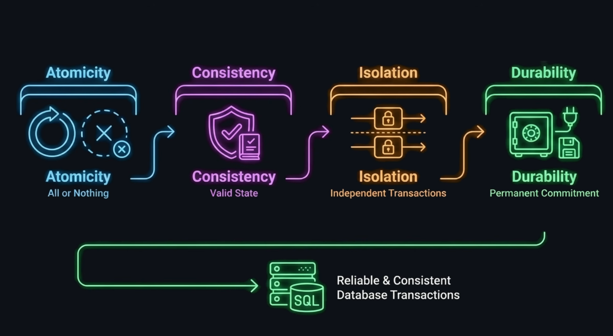
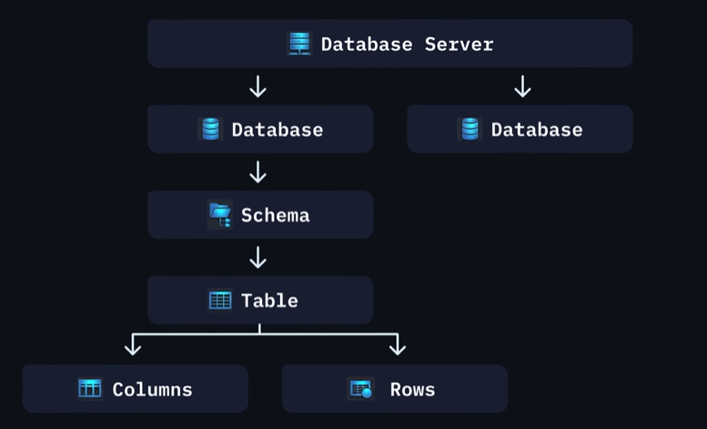

# Everything I Know About PostgreSQL

**Started:** _April 27th, 2026_

**Note:** This section compiles different lessons from courses and other learning resources. Most of the theory was not written by me. These are the **references** for most of the knowledge in this section:

- [Full Stack Engineering Course | Build and Deploy a Full Stack PERN Admin Dashboard in 2026 - JavaScript Mastery](https://www.youtube.com/watch?v=ek7hmv5PVV8)

**Table of contents**

- [Everything I Know About PostgreSQL](#everything-i-know-about-postgresql)
  - [Relational databases](#relational-databases)
  - [PostgreSQL is ACID compliant](#postgresql-is-acid-compliant)
  - [Running PostgreSQL in a Docker container (best practice)](#running-postgresql-in-a-docker-container-best-practice)
    - [Why using Docker is better](#why-using-docker-is-better)
  - [Step 1: Create database-related environment variables](#step-1-create-database-related-environment-variables)
  - [Step 2: Create the docker-compose.yml file and start the container](#step-2-create-the-docker-composeyml-file-and-start-the-container)
  - [Step 3: Download a database GUI and connect to your container](#step-3-download-a-database-gui-and-connect-to-your-container)
  - [PostgreSQL structure](#postgresql-structure)
  - [Column Data Types](#column-data-types)
  - [Constraints](#constraints)
  - [Create a sample table](#create-a-sample-table)
  - [Insert values into a table](#insert-values-into-a-table)
  - [Query values from a table](#query-values-from-a-table)
  - [Update values in a table](#update-values-in-a-table)
  - [Delete values in a table](#delete-values-in-a-table)

## Relational databases

Ideal for highly-structured and consistent data, organized in tables, with clear relationships. Relational databases can help with:

- Constraints
- Foreign keys
- Unique indexes
- Transactions
- Isolation levels

## PostgreSQL is ACID compliant



## Running PostgreSQL in a Docker container (best practice)

When you build an app, your code needs a database to talk to. That database has to run somewhere. You can use a service like Supabase to set up a PostgreSQL database entirely hosted on the cloud. Locally, you have two choices for where PostgreSQL runs:

- Directly on your machine (installed like any program)
- Inside Docker (isolated in a container).

### Why using Docker is better

Your laptop is a server. When you install PostgreSQL directly, it runs as a service on that server, sharing your OS, your ports, your file system. If you install a different version of PostgreSQL for another project, they conflict. Docker solves this by creating **containers**. A container is an isolated process with its own filesystem, its own network, its own dependencies. PostgreSQL running in a container has no idea what else is on your machine, and your machine barely knows the container exists.

- Every project gets its own PostgreSQL instance, isolated, no conflicts
- A teammate can clone your repo, run one command, and have the exact same database setup
- Local and production environments behave consistently because the container spec is defined in a file you control

## Step 1: Create database-related environment variables

Your app needs to know things like:

- What's the database password?
- What port should the server run on?
- What's the database host?

These variables can be stored in your `.env` local file for development, or AWS Secrets Manager in production. Your code doesn't change. Only the environment changes.

```bash
APP_NAME=
DB_HOST=localhost
DB_PORT=5432
DB_NAME=
DB_USER=
DB_PASSWORD=
```

## Step 2: Create the docker-compose.yml file and start the container

Docker can run a single container with a long terminal command. But when you have multiple containers (your app + PostgreSQL), typing that command every time is painful.
Docker Compose solves this. It's a single file (`docker-compose.yml`) that describes all your containers and how they connect, so you can start everything with one command:

```bash
docker compose up
```

A minimal `docker-compose.yml` file to spin up a PostgreSQL database looks like this:

```yaml
services:
  postgres:
    image: postgres:16 # Docker downloads a pre-built PostgreSQL image from Docker Hub. The :16 pins the version. Always pin versions. Never use :latest, because it can change without warning and break your app.
    container_name: ${APP_NAME}_db_postgres # Names the container so you can reference it by name instead of a random ID.
    environment: # These are environment variables injected into the container. PostgreSQL reads these on first startup to create the database, user, and set the password. Your actual password never lives in docker-compose.yml, it's pulled from .env at runtime.
      POSTGRES_DB: ${DB_NAME}
      POSTGRES_USER: ${DB_USER}
      POSTGRES_PASSWORD: ${DB_PASSWORD}
    ports: # This maps a port on your machine to a port inside the container. Format is host:container. PostgreSQL inside the container always listens on 5432. You're saying "expose that as port 5432 on my machine too." This is how your code running outside Docker can talk to PostgreSQL running inside Docker.
      - "${DB_PORT}:5432"
    volumes: # By default, when a Docker container stops, all data inside it is deleted. A volume tells Docker to store the database files on your actual machine's disk, outside the container. When the container restarts, it mounts that data back in. Without this, you'd lose all your data every time you stopped Docker.
      - postgres_data:/var/lib/postgresql/data # Store everything PostgreSQL writes to /var/lib/postgresql/data (inside the container) in a Docker-managed volume called postgres_data (on your machine).

volumes: # Registers that named volume with Docker.
  postgres_data:
```

After filling in the environment variables, open a terminal (WSL if on Windows) inside the project folder and run:

```bash
docker compose up -d # The -d flag means "detached", it runs in the background so your terminal stays free.

# Verify container is running
docker compose ps

# Connect to the database inside the container
docker exec -it app_name_db_postgres psql -U db_user -d db_name # -it runs a command inside a running container interactively

# You can run SQL commands from the CLI now
```

## Step 3: Download a database GUI and connect to your container

You can use DBeaver, for example. Download the software and initiate a new connection to the database running inside the Docker container, using the variables stored in your `.env` file.

## PostgreSQL structure



PostgreSQL organizes data in layers, from the outermost to the innermost:

**Server** > **Database** > **Schema** > **Table**

- **Server**: A running Postgres instance. One server can host many databases.
- **Database**: A container that holds all your data for one application.
- **Schema**: A namespace inside a database. Everything lives in `public` by default.
- **Table**: Lives inside a schema. Made up of columns (structure) and rows (data).

## Column Data Types

Choose the most specific type that fits your data. Using the right type enforces data integrity at the database level.

| Category               | Types                      | Use when                                                                     |
| ---------------------- | -------------------------- | ---------------------------------------------------------------------------- |
| Whole numbers          | `INTEGER`, `BIGINT`        | Counts, IDs, quantities. Use `BIGINT` when values exceed ~2 billion.         |
| Decimals (exact)       | `NUMERIC`, `DECIMAL`       | Money or anything where precision matters.                                   |
| Decimals (approximate) | `REAL`, `DOUBLE PRECISION` | Scientific data where small rounding errors are acceptable.                  |
| Text                   | `VARCHAR(n)`, `TEXT`       | `VARCHAR` enforces a max length. `TEXT` is unlimited.                        |
| Boolean                | `BOOLEAN`                  | True/false values.                                                           |
| Date/time              | `DATE`, `TIMESTAMP`        | `DATE` is date only. `TIMESTAMP` includes time.                              |
| JSON                   | `JSONB`                    | Semi-structured data. Stored in binary, so it's indexable and fast to query. |

## Constraints

Constraints are rules enforced by Postgres on your columns. They prevent bad data from entering the table in the first place.

- **Primary Key**: Uniquely identifies each row. Postgres creates an index on it automatically. Every table should have one.
- **Foreign Key**: Links a column to the primary key of another table. Enforces referential integrity — you can't reference a row that doesn't exist.
- **Not Null**: The column must always have a value. Useful when a field is required by your business logic.
- **Unique**: No two rows can have the same value in this column. Useful for things like email addresses or usernames.
- **Check**: Defines a custom condition the value must pass. Example: `CHECK (age >= 0)`.

## Create a sample table

Open a SQL worksheet inside your database management system (DBeaver, for example) and run:

```sql
create table if not exists pokemon(
id serial primary key,
name varchar(100) not null,
type varchar(20)[] not null,
height numeric(5, 1),
evolves boolean,
created_at timestamp default current_timestamp
)
```

You can store this script inside your repo, under a `database/` folder, for version control purposes. A best practice is to write the query to account for the table already existing and containing multiple constraints and checks (like `not null`). That way, you can run this script and recreate the table anywhere else.

## Insert values into a table

```sql
insert into pokemon (name, type, height, evolves)
values
    ('Bulbasaur', array['Grass', 'Poison'], 0.7, true),
    ('Ivysaur', array['Grass', 'Poison'], 1, true),
    ('Venusaur', array['Grass', 'Poison'], 2, false)
```

## Query values from a table

```sql
select * from pokemon

select name, type from pokemon order by id desc

select * from pokemon where evolves is true

select * from pokemon where evolves is true and 'Grass' = any(type)

-- Adding limits to the results (return the two tallest pokemon)
select * from pokemon order by height desc limit 2
```

## Update values in a table

```sql
update pokemon set height = 3 where name = 'Venusaur'
```

## Delete values in a table

```sql
delete from pokemon where name = 'fake pokemon'
```
